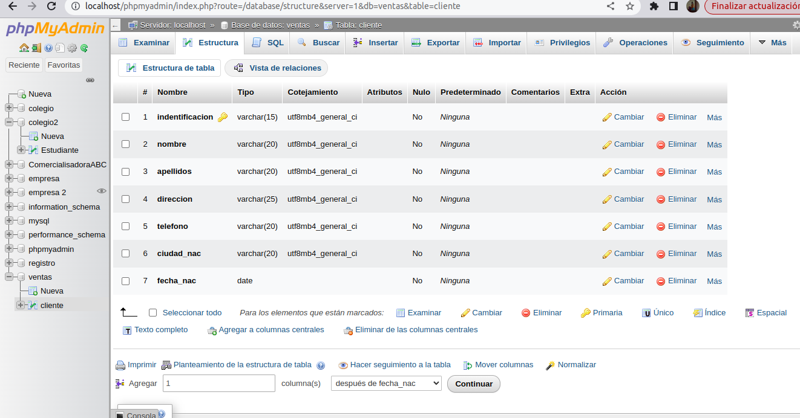
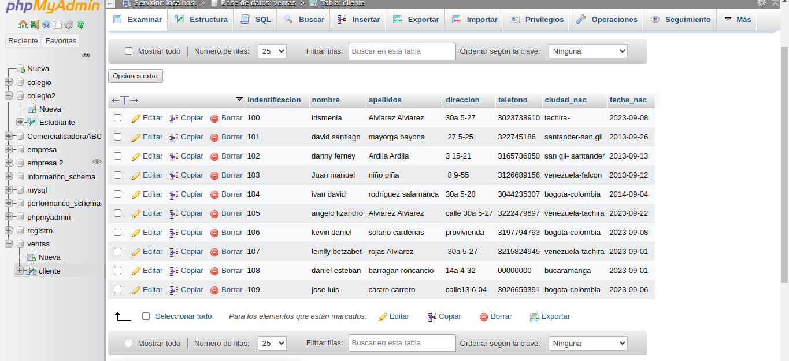

# introduccion a SQL

1.creacion de una base de datos (BD) con MySql usando phpmyAdmin

## DICCIONARIO DE DATOS
|campo|Tipo de dato|Longitud|
|-----|------------|--------|
|***identificacion**|varchar|15|
|nombre|varchar|20|
|apellidos|varchar|20|
|direccion|varchar|25|
|telefono|varchar|20|
|ciudad_nac|varchar|20|
|fecha_nac|date||

### codigo SQL de creacion de la tabla cliente 
CREATE TABLE `Ventas`.`Cliente` (`identificacion` VARCHAR(15) NOT NULL , `nombre` VARCHAR(20) NOT NULL , `apellidos` VARCHAR(20) NOT NULL , `direccion` VARCHAR(25) NOT NULL , `telefono` VARCHAR(20) NOT NULL , `ciudad_nac` VARCHAR(20) NOT NULL , `fecha_nac` DATE NOT NULL , PRIMARY KEY (`identificacion`)) ENGINE = InnoDB;

### Diccionario de datos en phpMyAdmin

## codigo SQL de inserción de un registro a la tabla cliente
INSERT INTO `cliente` (`indentificacion`, `nombre`, `apellidos`, `direccion`, `telefono`, `ciudad_nac`, `fecha_nac`) VALUES ('114', 'irismenia', '', 'calle 30a 5-27', '3023738910', 'tachira', '2005-03-29');

### Registro de datos en tabla clientes
